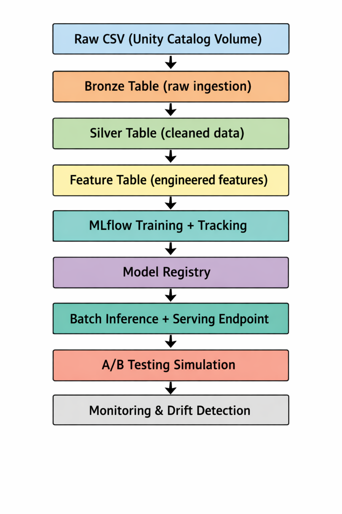
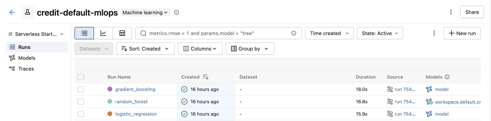

# Credit Default Prediction MLOps Pipeline

## Business Problem

Financial institutions need to identify customers who are likely to **default on credit card payments**. Missing defaulters leads to financial loss, while over-restricting credit reduces customer growth.

This project builds an **end-to-end MLOps pipeline** to predict whether a customer will default next month and demonstrates how such a model is **trained, deployed, and monitored in production**.

---

## Dataset

- Dataset: *Default of Credit Card Clients*
- Source: UCI / Kaggle
- Size: ~30,000 records
- Target variable: `default_next_month` (0 = no default, 1 = default)

### Key features:
- Demographics: age, gender, education
- Credit info: credit limit
- Payment history: repayment status over 6 months
- Billing and payment amounts

---

## Architecture

---

## Feature Engineering

### Repayment behavior
- `avg_delay_6m`
- `max_delay_6m`
- `late_payment_count_6m`
- `recent_delay_trend`

### Bill behavior
- `avg_bill_amt_6m`
- `bill_volatility_6m`
- `bill_growth_rate`

### Payment behavior
- `avg_pay_amt_6m`
- `total_paid_6m`
- `payment_volatility_6m`

### Utilization features
- `utilization_latest`
- `avg_utilization_6m`
- `pay_to_bill_ratio`

### Customer profile
- `age_bucket`
- interaction features

---

## MLflow Experiment Tracking

Models trained:
- Logistic Regression
- Random Forest
- Gradient Boosting

Tracked in MLflow:
- Parameters
- Metrics (AUC, recall, precision, F1)
- Artifacts (confusion matrix, feature importance)
- Model versions

---

## Model Comparison

Selection rule:

- Choose model with **highest validation AUC**
- If similar, prefer **higher recall for defaulters**
- Apply **decision threshold tuning**

---

## Serving Architecture

- Model deployed using **Databricks Model Serving**
- Exposed as REST API
- Accepts full feature payload
- Returns:
  - prediction
  - default probability

---

## A/B Testing Design

Simulated A/B testing:

- Model A: Random Forest  
- Model B: Gradient Boosting 
- Traffic split: 50% / 50%

Logged:
- request ID
- model used
- prediction
- probability
- latency
- timestamp

Evaluated:
- AUC by model
- approval rate
- average predicted risk

---

## Monitoring & Drift Detection

### Prediction monitoring
- average predicted probability
- high-risk proportion
- prediction volume

### Feature drift
Compared training vs inference:
- `avg_delay_6m`
- `avg_utilization_6m`
- `credit_limit`
- `age`

Metrics:
- mean shift
- std deviation shift
- PSI

### Performance monitoring
- rolling AUC
- rolling recall
- default rate

---

## CI/CD & Asset Bundles

### CI (GitHub Actions)
- `pytest` for unit testing
- `black --check` for formatting
- `ruff` for linting
- import validation

### CD (Databricks Asset Bundles)

**Training workflow**
- ingestion
- feature engineering
- training
- model registration

**Monitoring workflow**
- batch inference
- drift detection

---

---

## How to Run

### 1. Install dependencies

`pip install -r requirements.txt
`

### 2. Configure Databricks CLI

`databricks configure --token`

### 3. Deploy workflows
`databricks bundle validate`

`databricks bundle deploy`

### 4. Run workflows

`databricks bundle run credit_default_training_workflow`

`databricks bundle run credit_default_monitoring_workflow`

